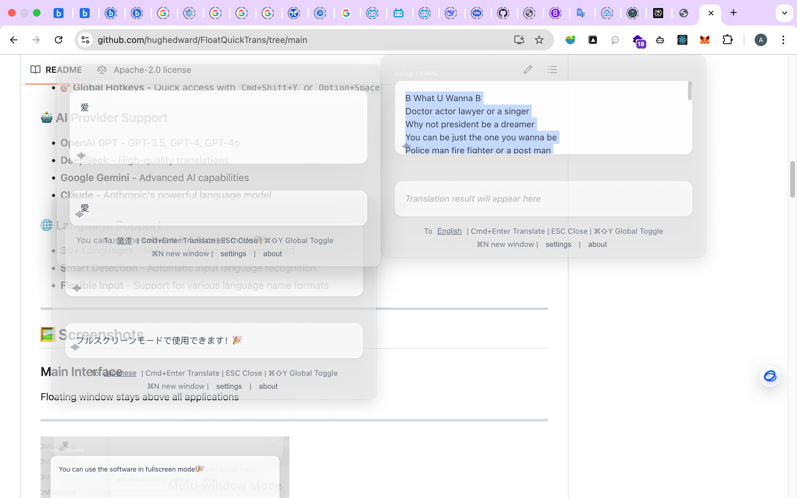
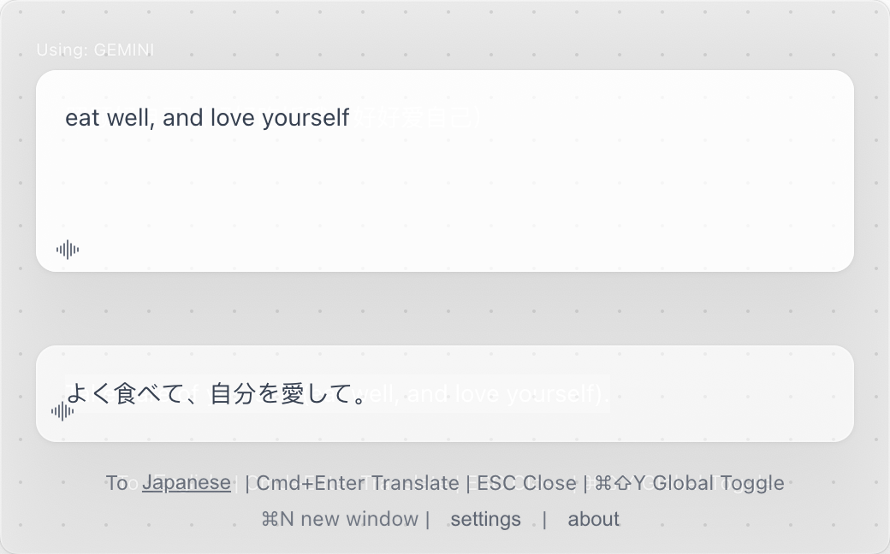
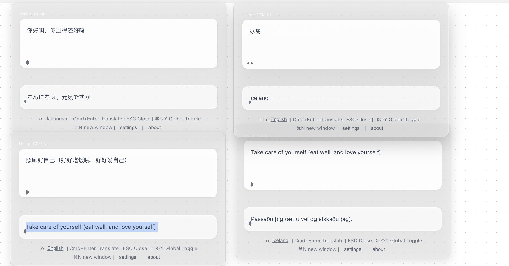
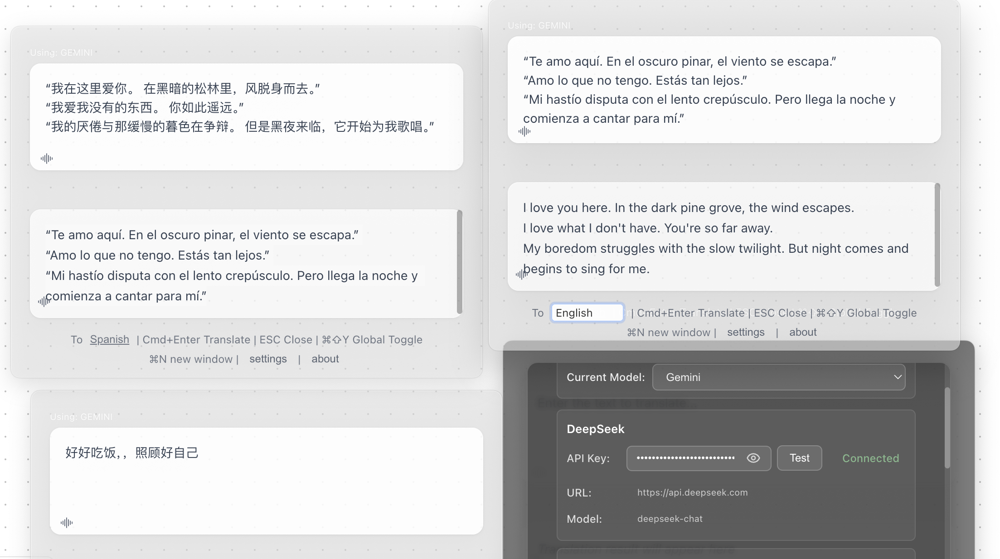
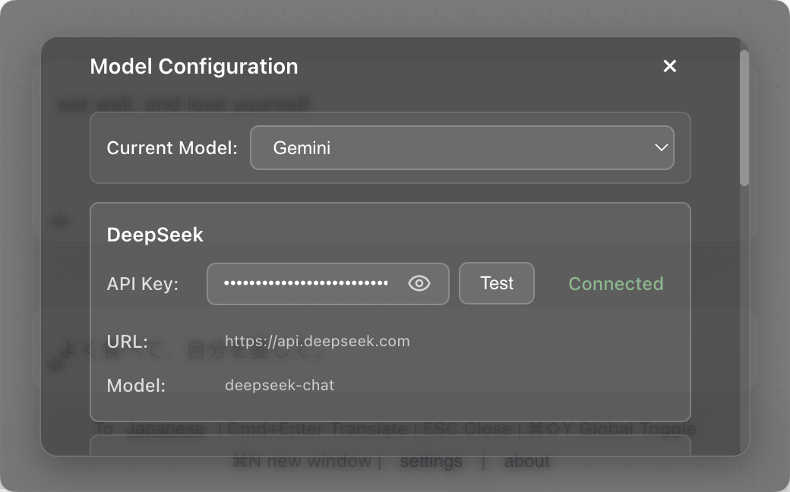

<div align="center">

# 🌍 FloatQuickTrans🎉

**A Professional Floating AI Translation Tool**

*Real-time streaming translation • Multi-window support • Text-to-speech • Always on top*

[](https://github.com/hughedward/FloatQuickTrans)
[](https://github.com/hughedward/FloatQuickTrans)
[](LICENSE)

[English](README.md) • [简体中文](docs/README-zh.md) • [繁體中文](docs/README-zh-TW.md) • [日本語](docs/README-ja.md) • [Français](docs/README-fr.md) • [Deutsch](docs/README-de.md) • [Español](docs/README-es.md) • [한국어](docs/README-ko.md) • [Русский](docs/README-ru.md) • [Türkçe](docs/README-tr.md)

</div>

---

### 👀 Quick Look (Videos)
[](https://www.youtube.com/watch?v=vU78uvya_OE)
[](https://www.youtube.com/watch?v=ki4z5593GHs)


## ✨ Features

### 🚀 **Core Capabilities**
- **🌊 Real-time Streaming Translation** - Watch translations appear as they're generated
- **🪟 Multi-window Support** - Create multiple translation windows with `Cmd+N`/`Ctrl+N`
- **🔊 Text-to-Speech** - Listen to translations in 30+ languages
- **📌 Always on Top** - Floating window stays above all applications
- **🎯 Global Hotkeys** - Quick access with `Cmd+Shift+Y` or `Option+Space`

### 🤖 **AI Provider Support**
- <i>TODO</i>: **OpenAI GPT** - GPT-3.5, GPT-4, GPT-4o
- **DeepSeek** - High-quality translations
- **Google Gemini** - Advanced AI capabilities
- <i>TODO</i>:**Claude** - Anthropic's powerful language model

> <i><font color=red>⚠️ OpenAI and Claude:  No API keys available yet, so no support for now.  Sorry about that.</font></i>

### 🌐 **Language Support**
- **30+ Languages** - Major world languages supported
- **Smart Detection** - Automatic input language recognition
- **Flexible Input** - Support for various language name formats

---

## 🖼️ Screenshots

### Main Interface
Floating window stays above all applications

---

 


 

 

### Multi-window Mode

 

 


### Settings Panel

> **Go** https://aistudio.google.com/app/apikey  🧚‍♀️
>
> Or https://platform.deepseek.com/usage 🐳

 

---

## 🚀 Quick Start

### Prerequisites
- Node.js 18+
- pnpm (recommended) or npm

### Installation

```bash
# Clone the repository
git clone https://github.com/hughedward/FloatQuickTrans.git
cd FloatQuickTrans

# Install dependencies
pnpm install
```

### Development

```bash
# Start development server
pnpm dev
```

### Build

```bash
# Build for your platform
pnpm build

# Platform-specific builds
pnpm build:mac    # macOS
pnpm build:win    # Windows
pnpm build:linux  # Linux
```

---

## ⚙️ Configuration

### API Setup
1. Click the **Settings** button in the app
2. Choose your preferred AI provider
3. Enter your API key
4. Select default translation language

### Supported Providers
| Provider | API Key Required | Features |
|----------|------------------|----------|
| OpenAI | TODO | GPT-3.5, GPT-4, GPT-4o |
| DeepSeek | ✅ | High-quality translation |
| Google Gemini | ✅ | Advanced AI capabilities |
| Claude | TODO | Anthropic's language model |

---

## 🎮 Usage

### Basic Translation
1. **Input Text** - Type or paste text to translate
2. **Set Target Language** - Click language button to change
3. **Translate** - Press `Cmd+Enter` or click translate
4. **Listen** - Click 🔊 icon to hear pronunciation

### Multi-window Workflow
1. **Create New Window** - Press `Cmd+N` (macOS) or `Ctrl+N` (Windows)
2. **Independent Translation** - Each window works separately
3. **Compare Results** - Use multiple windows to compare translations

### Global Hotkeys
- `Cmd+Shift+Y` / `Ctrl+Shift+Y` - Show/hide all windows
- `Cmd+N` / `Ctrl+N` - Create new translation window
- `Cmd+Enter` - Execute translation
- `ESC` - Close current window

---

## 🛠️ Development

### Tech Stack
- **Frontend**: React 19 + TypeScript
- **Desktop**: Electron 35
- **Build Tool**: Vite + electron-vite
- **Styling**: CSS with glass morphism effects

### Project Structure
```
src/
├── main/           # Electron main process
├── renderer/       # React frontend
├── preload/        # Electron preload scripts
└── model/          # AI providers & language maps
```

### Contributing
1. Fork the repository
2. Create your feature branch (`git checkout -b feature/amazing-feature`)
3. Commit your changes (`git commit -m 'Add amazing feature'`)
4. Push to the branch (`git push origin feature/amazing-feature`)
5. Open a Pull Request

---

## 📄 License

This project is licensed under the MIT License - see the [LICENSE](LICENSE) file for details.

---

## 🙏 Acknowledgments

- Built with [Electron](https://electronjs.org/) and [React](https://reactjs.org/)
- Icons from [Bootstrap Icons](https://icons.getbootstrap.com/)
- AI providers: OpenAI, DeepSeek, Google, Anthropic

---

<div align="center">

**Made with ❤️ for the global community**

[⭐ Star this project](https://github.com/hughedward/FloatQuickTrans) • [🐛 Report Bug](https://github.com/hughedward/FloatQuickTrans/issues) • [💡 Request Feature](https://github.com/hughedward/FloatQuickTrans/issues)

</div>

## Star History

[](https://www.star-history.com/#hughedward/FloatQuickTrans&Date)

> thanks `https://www.star-history.com/#hughedward/FloatQuickTrans&Date`
>
> 
>
> **If you find my work helpful, I’d be truly grateful if you’d consider sponsoring me.**
>
>  
>
> <a href="https://buy.stripe.com/cNi9AU02E0tN2h1dUDbjW01">
> 
> </a>
>
> 
> Your support is the driving force behind my creations.🎉


