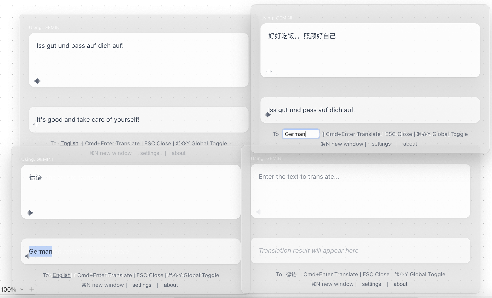
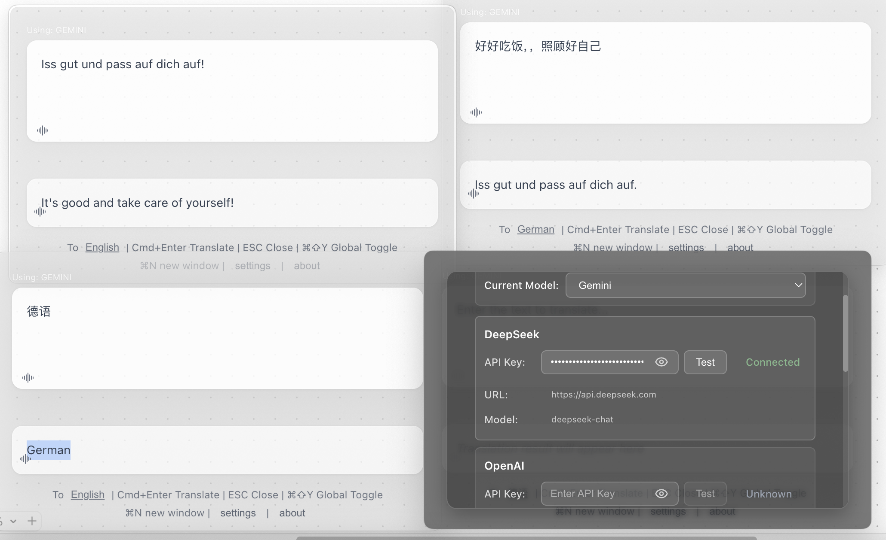

<div align="center">

# 🌍 FloatQuickTrans

**Professionelles Schwebendes KI-Übersetzungstool**

*Echtzeit-Streaming-Übersetzung • Multi-Fenster-Unterstützung • Text-zu-Sprache • Immer im Vordergrund*

[](https://github.com/hughedward/FloatQuickTrans)
[](https://github.com/hughedward/FloatQuickTrans)
[](../LICENSE)

[English](../README.md) • [简体中文](README-zh.md) • [繁體中文](README-zh-TW.md) • [日本語](README-ja.md) • [Français](README-fr.md) • [Deutsch](README-de.md) • [Español](README-es.md) • [한국어](README-ko.md) • [Русский](README-ru.md) • [Türkçe](README-tr.md)

</div>

---

## ✨ Funktionen

### 🚀 **Kernfunktionen**
- **🌊 Echtzeit-Streaming-Übersetzung** - Beobachten Sie, wie Übersetzungen generiert werden
- **🪟 Multi-Fenster-Unterstützung** - Erstellen Sie mehrere Übersetzungsfenster mit `Cmd+N`/`Ctrl+N`
- **🔊 Text-zu-Sprache** - Hören Sie Übersetzungen in über 30 Sprachen
- **📌 Immer im Vordergrund** - Schwebendes Fenster bleibt über allen Anwendungen
- **🎯 Globale Hotkeys** - Schneller Zugriff mit `Cmd+Shift+Y` oder `Option+Space`

### 🤖 **KI-Anbieter-Unterstützung**
- **OpenAI GPT** - GPT-3.5, GPT-4, GPT-4o
- **DeepSeek** - Hochwertige Übersetzungen
- **Google Gemini** - Fortschrittliche KI-Fähigkeiten
- **Claude** - Anthropics leistungsstarkes Sprachmodell

---

## 🖼️ Screenshots

<div align="center">

### Hauptoberfläche


### Multi-Fenster-Modus


### Einstellungen


</div>

---

## 🚀 Schnellstart

### Voraussetzungen
- Node.js 18+
- pnpm (empfohlen) oder npm

### Installation

```bash
# Repository klonen
git clone https://github.com/hughedward/FloatQuickTrans.git
cd FloatQuickTrans

# Abhängigkeiten installieren
pnpm install
```

### Entwicklung

```bash
# Entwicklungsserver starten
pnpm dev
```

---

## 🎮 Verwendung

### Grundlegende Übersetzung
1. **Text eingeben** - Geben Sie Text ein oder fügen Sie ihn ein
2. **Zielsprache festlegen** - Klicken Sie auf die Sprachschaltfläche zum Ändern
3. **Übersetzen** - Drücken Sie `Cmd+Enter` oder klicken Sie auf Übersetzen
4. **Anhören** - Klicken Sie auf das 🔊-Symbol, um die Aussprache zu hören

### Multi-Fenster-Workflow
1. **Neues Fenster erstellen** - Drücken Sie `Cmd+N` (macOS) oder `Ctrl+N` (Windows)
2. **Unabhängige Übersetzung** - Jedes Fenster arbeitet separat
3. **Ergebnisse vergleichen** - Verwenden Sie mehrere Fenster, um Übersetzungen zu vergleichen

---
### Technologie-Stack
- **Frontend**: React 19 + TypeScript
- **Desktop**: Electron 35
- **Build-Tools**: Vite + electron-vite
- **Styling**: CSS Glassmorphism-Effekte

### Projektstruktur
```
src/
├── main/           # Electron-Hauptprozess
├── renderer/       # React-Frontend
├── preload/        # Electron-Preload-Skripte
└── model/          # AI-Anbieter & Sprachzuordnung
```

### 🫰 Mitwirken
Wir freuen uns über Community-Beiträge! So können Sie mitmachen:
1.  Forken Sie dieses Repository
2.  Erstellen Sie einen Feature-Branch (`git checkout -b feature/tolle-funktion`/`git checkout -b bugfix/behebe-xxx-problem`)
3.  Committen Sie Ihre Änderungen (`git commit -m 'Füge tolle Funktion hinzu'`/`git commit -m 'Behebe xxx-Problem: xxxx'`). Bitte verwenden Sie beschreibende Nachrichten/Kürzel und fügen Sie nach Möglichkeit Code-Kommentare hinzu.
4.  Pushen Sie zum Branch (`git push origin feature/tolle-funktion`/`git push origin bugfix/behebe-xxx-problem`). Halten Sie den Code sauber.
5.  Erstellen Sie einen Pull Request. Konzentrieren Sie sich pro PR auf ein Feature oder einen Fix, um umfangreiche Änderungen zu vermeiden.
6.  Wir prüfen Ihren PR und mergen ihn, sobald er bereit ist. Unterstützung bei der Review anderer PRs ist ebenfalls willkommen!
7.  Um das Verständnis und die Kommunikation zu erleichtern, wird empfohlen, Englisch bei der Einreichung von Fragen, Pull Requests und ähnlichen Aktionen zu verwenden.
---

## 📄 Lizenz

Dieses Projekt steht unter der MIT-Lizenz - Details finden Sie in der [LICENSE](../LICENSE)-Datei.

<div align="center">

**Mit ❤️ für die globale Gemeinschaft erstellt**

[⭐ Projekt mit Stern versehen](https://github.com/hughedward/FloatQuickTrans) • [🐛 Fehler melden](https://github.com/hughedward/FloatQuickTrans/issues) • [💡 Funktion vorschlagen](https://github.com/hughedward/FloatQuickTrans/issues)

</div>

## Star History

[](https://www.star-history.com/#hughedward/FloatQuickTrans&Date)
