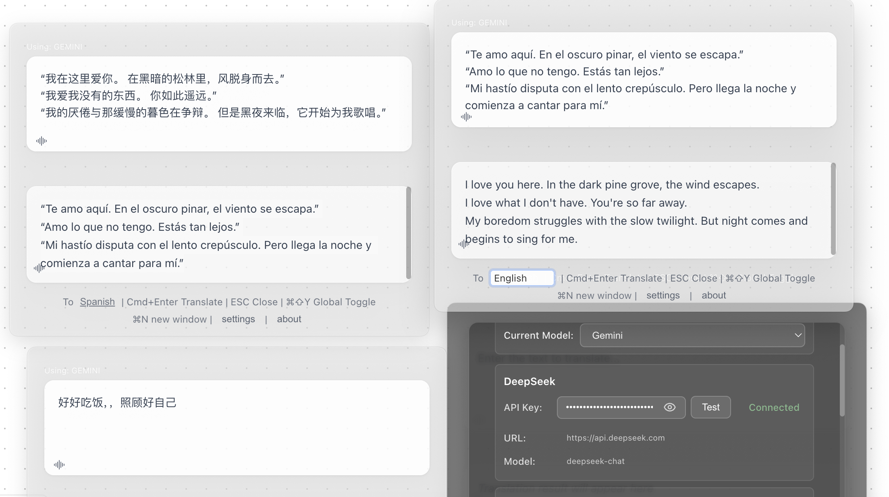
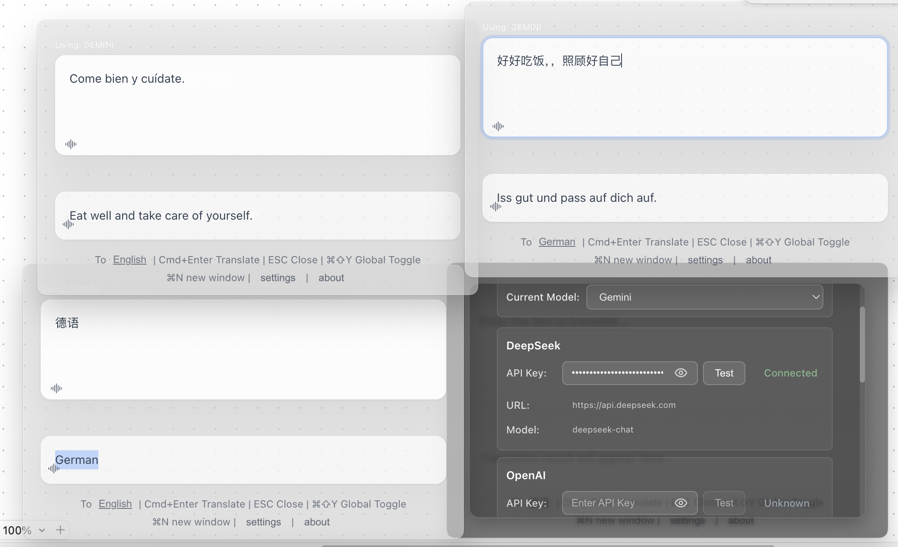
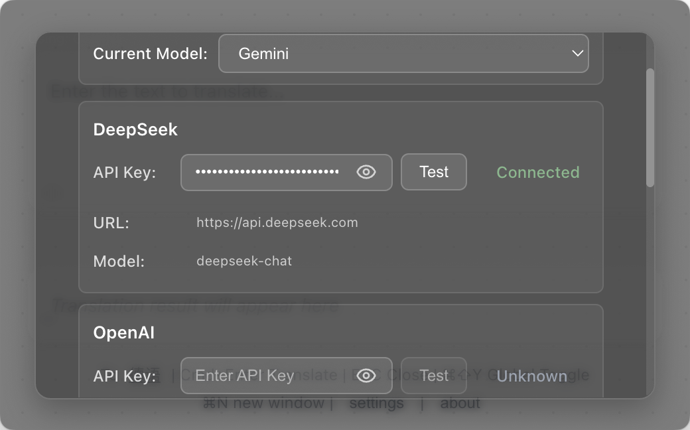

<div align="center">

# 🌍 FloatQuickTrans

**Herramienta Profesional de Traducción IA Flotante**

*Traducción en tiempo real • Soporte multi-ventana • Texto a voz • Siempre visible*

[](https://github.com/hughedward/FloatQuickTrans)
[](https://github.com/hughedward/FloatQuickTrans)
[](../LICENSE)

[English](../README.md) • [简体中文](README-zh.md) • [繁體中文](README-zh-TW.md) • [日本語](README-ja.md) • [Français](README-fr.md) • [Deutsch](README-de.md) • [Español](README-es.md) • [한국어](README-ko.md) • [Русский](README-ru.md) • [Türkçe](docs/README-tr.md)

</div>

---

## ✨ Características

### 🚀 **Capacidades Principales**
- **🌊 Traducción en Tiempo Real** - Observe cómo aparecen las traducciones mientras se generan
- **🪟 Soporte Multi-ventana** - Cree múltiples ventanas de traducción con `Cmd+N`/`Ctrl+N`
- **🔊 Texto a Voz** - Escuche traducciones en más de 30 idiomas
- **📌 Siempre Visible** - La ventana flotante permanece sobre todas las aplicaciones
- **🎯 Atajos Globales** - Acceso rápido con `Cmd+Shift+Y` o `Option+Space`

### 🤖 **Soporte de Proveedores IA**
- **OpenAI GPT** - GPT-3.5, GPT-4, GPT-4o
- **DeepSeek** - Traducciones de alta calidad
- **Google Gemini** - Capacidades avanzadas de IA
- **Claude** - Potente modelo de lenguaje de Anthropic

---

## 🖼️ Capturas de Pantalla

<div align="center">

### Interfaz Principal


### Modo Multi-ventana



### Panel de Configuración


</div>

---

## 🚀 Inicio Rápido

### Requisitos Previos
- Node.js 18+
- pnpm (recomendado) o npm

### Instalación

```bash
# Clonar el repositorio
git clone https://github.com/hughedward/FloatQuickTrans.git
cd FloatQuickTrans

# Instalar dependencias
pnpm install
```

### Desarrollo

```bash
# Iniciar servidor de desarrollo
pnpm dev
```

---

## 🎮 Uso

### Traducción Básica
1. **Introducir Texto** - Escriba o pegue texto para traducir
2. **Establecer Idioma Destino** - Haga clic en el botón de idioma para cambiar
3. **Traducir** - Presione `Cmd+Enter` o haga clic en traducir
4. **Escuchar** - Haga clic en el icono 🔊 para escuchar la pronunciación

### Flujo de Trabajo Multi-ventana
1. **Crear Nueva Ventana** - Presione `Cmd+N` (macOS) o `Ctrl+N` (Windows)
2. **Traducción Independiente** - Cada ventana funciona por separado
3. **Comparar Resultados** - Use múltiples ventanas para comparar traducciones

---

<div align="center">

**Hecho con ❤️ para la comunidad global**

[⭐ Destacar este proyecto](https://github.com/hughedward/FloatQuickTrans) • [🐛 Reportar Error](https://github.com/hughedward/FloatQuickTrans/issues) • [💡 Solicitar Función](https://github.com/hughedward/FloatQuickTrans/issues)

</div>

## Star History

[](https://www.star-history.com/#hughedward/FloatQuickTrans&Date)
