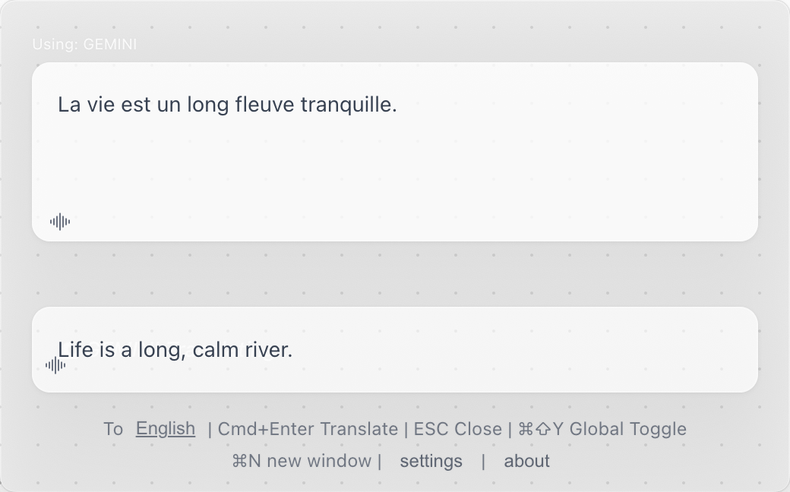
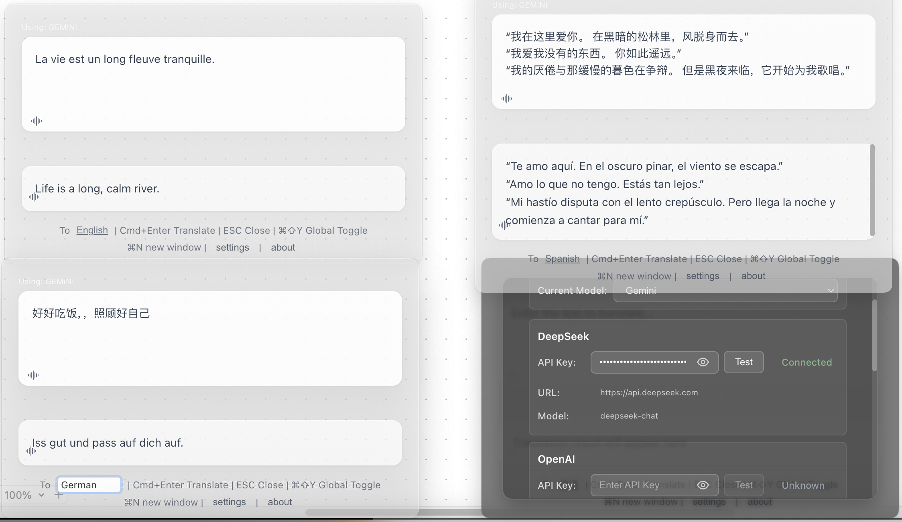

<div align="center">

# 🌍 FloatQuickTrans

**Outil de Traduction IA Flottant Professionnel**

*Traduction en streaming temps réel • Support multi-fenêtres • Synthèse vocale • Toujours au premier plan*

[](https://github.com/hughedward/FloatQuickTrans)
[](https://github.com/hughedward/FloatQuickTrans)
[](../LICENSE)

[English](../README.md) • [简体中文](README-zh.md) • [繁體中文](README-zh-TW.md) • [日本語](README-ja.md) • [Français](README-fr.md) • [Deutsch](README-de.md) • [Español](README-es.md) • [한국어](README-ko.md) • [Русский](README-ru.md) • [Türkçe](README-tr.md)

</div>

---

## ✨ Fonctionnalités

### 🚀 **Capacités Principales**
- **🌊 Traduction en Streaming Temps Réel** - Regardez les traductions apparaître en temps réel
- **🪟 Support Multi-fenêtres** - Créez plusieurs fenêtres de traduction avec `Cmd+N`/`Ctrl+N`
- **🔊 Synthèse Vocale** - Écoutez les traductions dans plus de 30 langues
- **📌 Toujours au Premier Plan** - La fenêtre flottante reste au-dessus de toutes les applications
- **🎯 Raccourcis Globaux** - Accès rapide avec `Cmd+Shift+Y` ou `Option+Space`

### 🤖 **Support des Fournisseurs IA**
- **OpenAI GPT** - GPT-3.5, GPT-4, GPT-4o
- **DeepSeek** - Traductions de haute qualité
- **Google Gemini** - Capacités IA avancées
- **Claude** - Modèle de langage puissant d'Anthropic

---

## 🖼️ Captures d'écran

<div align="center">

### Interface Principale


### Mode Multi-fenêtres


### Panneau de Configuration


</div>

---

## 🚀 Démarrage Rapide

### Prérequis
- Node.js 18+
- pnpm (recommandé) ou npm

### Installation

```bash
# Cloner le dépôt
git clone https://github.com/hughedward/FloatQuickTrans.git
cd FloatQuickTrans

# Installer les dépendances
pnpm install
```

### Développement

```bash
# Démarrer le serveur de développement
pnpm dev
```

---

## 🎮 Utilisation

### Traduction de Base
1. **Saisir le Texte** - Tapez ou collez le texte à traduire
2. **Définir la Langue Cible** - Cliquez sur le bouton de langue pour changer
3. **Exécuter la Traduction** - Appuyez sur `Cmd+Enter` ou cliquez sur traduire
4. **Écouter** - Cliquez sur l'icône 🔊 pour entendre la prononciation

### Flux de Travail Multi-fenêtres
1. **Créer une Nouvelle Fenêtre** - Appuyez sur `Cmd+N` (macOS) ou `Ctrl+N` (Windows)
2. **Traduction Indépendante** - Chaque fenêtre fonctionne séparément
3. **Comparer les Résultats** - Utilisez plusieurs fenêtres pour comparer les traductions

---
# 🛠️ Développement

### Stack technique
- **Frontend**: React 19 + TypeScript
- **Desktop**: Electron 35
- **Outils de build**: Vite + electron-vite
- **Styles**: Effet verre (Glassmorphism) en CSS

### Structure du projet
```
src/
├── main/           # Processus principal Electron
├── renderer/       # Frontend React
├── preload/        # Scripts de préchargement Electron
└── model/          # Fournisseurs d'IA & mappings linguistiques
```

### 🫰 Contribuer
Nous accueillons les contributions de la communauté ! Si vous souhaitez contribuer, voici les étapes à suivre :
1.  Forkez ce dépôt
2.  Créez une branche de fonctionnalité (`git checkout -b feature/fonctionnalité-impressionnante`/`git checkout -b bugfix/correction-problème-xxx`)
3.  Committez vos modifications (`git commit -m 'Ajout d'une fonctionnalité impressionnante'`/`git commit -m 'Correction du problème xxx: xxxx'`). Veuillez utiliser des messages descriptifs/concise pour vos commits et ajouter des commentaires explicatifs dans le code si possible.
4.  Poussez vers la branche (`git push origin feature/fonctionnalité-impressionnante`/`git push origin bugfix/correction-problème-xxx`). Maintenez votre code propre.
5.  Ouvrez une Pull Request. Nous recommandons de se concentrer sur une seule fonctionnalité ou correction à la fois, évitez de soumettre trop de modifications en une seule fois.
6.  Nous examinerons votre PR et la fusionnerons une fois prête. Si vous souhaitez aider à examiner d'autres PR, nous vous en serions très reconnaissants !
7.  Pour faciliter la compréhension et la communication, il est recommandé d'utiliser l'anglais lors de la soumission de questions, de demandes de pull et d'autres opérations.

---

## 📄 Licence

Ce projet est sous licence MIT - voir le fichier [LICENSE](../LICENSE) pour plus de détails.


<div align="center">

**Fait avec ❤️ pour la communauté mondiale**

[⭐ Étoiler ce projet](https://github.com/hughedward/FloatQuickTrans) • [🐛 Signaler un Bug](https://github.com/hughedward/FloatQuickTrans/issues) • [💡 Demander une Fonctionnalité](https://github.com/hughedward/FloatQuickTrans/issues)

</div>

## Star History

[](https://www.star-history.com/#hughedward/FloatQuickTrans&Date)
