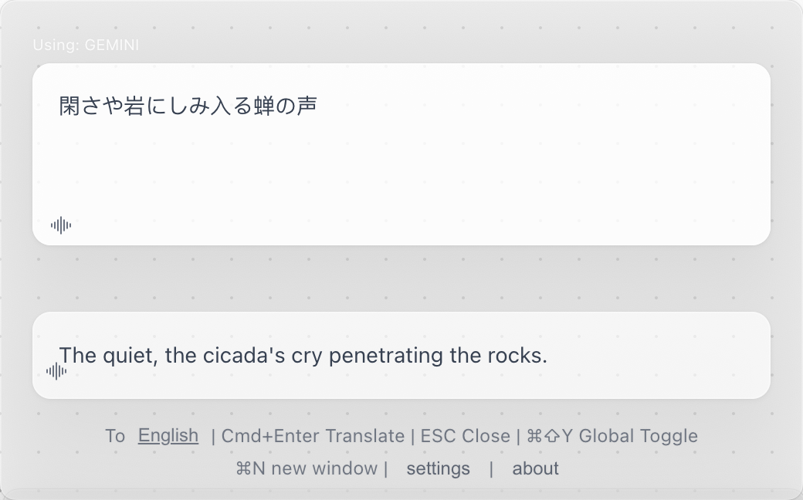
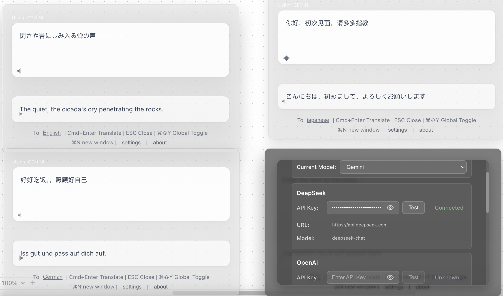

<div align="center">

# 🌍 FloatQuickTrans

**プロフェッショナルなフローティングAI翻訳ツール**

*リアルタイムストリーミング翻訳 • マルチウィンドウサポート • テキスト読み上げ • 常に最前面*

[](https://github.com/hughedward/FloatQuickTrans)
[](https://github.com/hughedward/FloatQuickTrans)
[](../LICENSE)

[English](../README.md) • [简体中文](README-zh.md) • [繁體中文](README-zh-TW.md) • [日本語](README-ja.md) • [Français](README-fr.md) • [Deutsch](README-de.md) • [Español](README-es.md) • [한국어](README-ko.md) • [Русский](README-ru.md)

</div>

---

## ✨ 機能

### 🚀 **コア機能**
- **🌊 リアルタイムストリーミング翻訳** - 翻訳が生成される様子をリアルタイムで確認
- **🪟 マルチウィンドウサポート** - `Cmd+N`/`Ctrl+N`で複数の翻訳ウィンドウを作成
- **🔊 テキスト読み上げ** - 30以上の言語での翻訳音声再生
- **📌 常に最前面** - フローティングウィンドウが常に最前面に表示
- **🎯 グローバルホットキー** - `Cmd+Shift+Y`または`Option+Space`で素早くアクセス

### 🤖 **AIプロバイダーサポート**
- **OpenAI GPT** - GPT-3.5, GPT-4, GPT-4o
- **DeepSeek** - 高品質翻訳
- **Google Gemini** - 高度なAI機能
- **Claude** - Anthropicの強力な言語モデル

---

## 🖼️ スクリーンショット

### メインインターフェース
-----------------------------------------------


> ⌘ + Shift + Y で全てのウィンドウの表示／非表示を切り替えることができます🦄
>
> ⌘ + N で新しいウィンドウを開けます ✨💡



### マルチウィンドウモード


### 設定パネル

> search https://aistudio.google.com/app/apikey to get an api key for gemini


---

## 🚀 クイックスタート

### 前提条件
- Node.js 18+
- pnpm（推奨）またはnpm

### インストール

```bash
# リポジトリをクローン
git clone https://github.com/hughedward/FloatQuickTrans.git
cd FloatQuickTrans

# 依存関係をインストール
pnpm install
```

### 開発

```bash
# 開発サーバーを起動
pnpm dev
```

---

## 🎮 使用方法

### 基本翻訳
1. **テキスト入力** - 翻訳したいテキストを入力またはペースト
2. **対象言語設定** - 言語ボタンをクリックして変更
3. **翻訳実行** - `Cmd+Enter`を押すか翻訳をクリック
4. **音声再生** - 🔊アイコンをクリックして発音を聞く

### マルチウィンドウワークフロー
1. **新しいウィンドウを作成** - `Cmd+N` (macOS)または`Ctrl+N` (Windows)を押す
2. **独立翻訳** - 各ウィンドウが独立して動作
3. **結果比較** - 複数のウィンドウを使用して翻訳結果を比較

---

<div align="center">

**グローバルコミュニティのために❤️で作成**

[⭐ プロジェクトにスター](https://github.com/hughedward/FloatQuickTrans) • [🐛 バグ報告](https://github.com/hughedward/FloatQuickTrans/issues) • [💡 機能リクエスト](https://github.com/hughedward/FloatQuickTrans/issues)

</div>

## Star History

[](https://www.star-history.com/#hughedward/FloatQuickTrans&Date)
