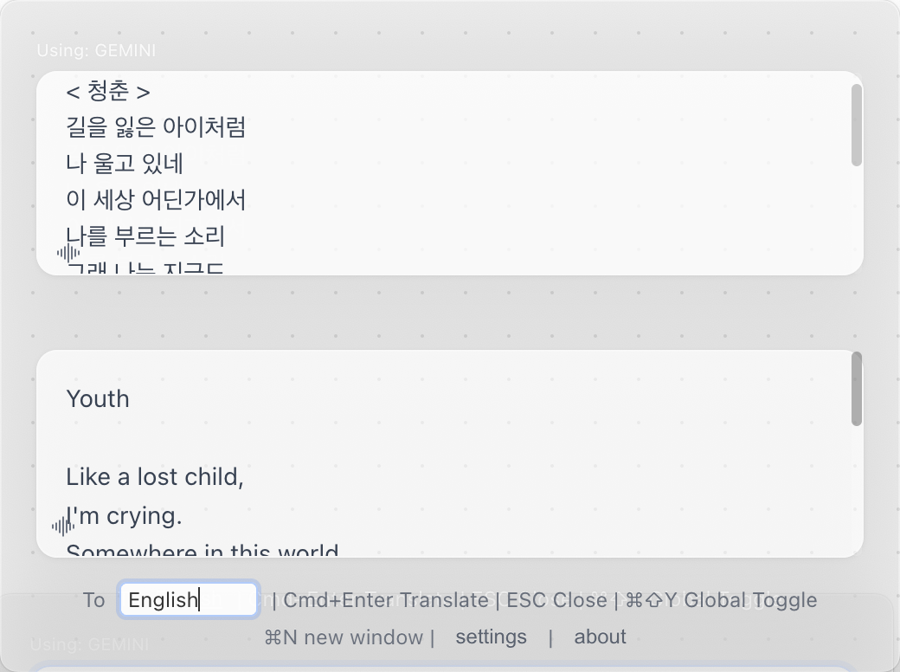
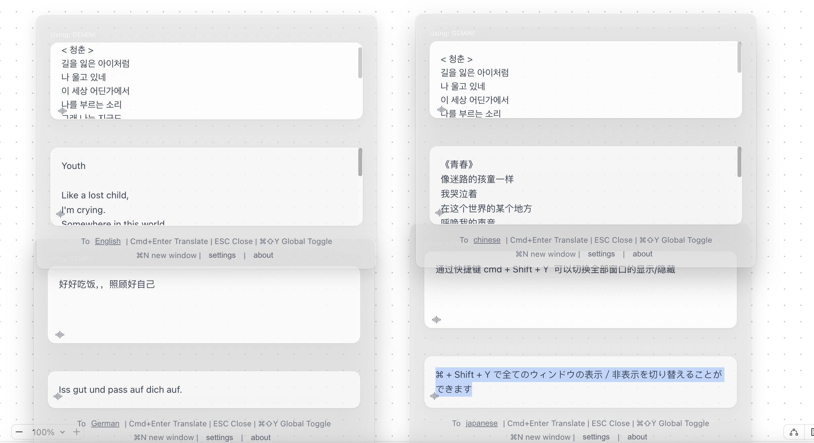
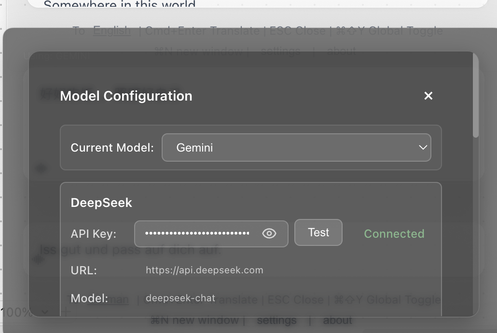

<div align="center">

# 🌍 FloatQuickTrans

**전문 플로팅 AI 번역 도구**

*실시간 스트리밍 번역 • 다중 창 지원 • 텍스트 음성 변환 • 항상 위에 표시*

[](https://github.com/hughedward/FloatQuickTrans)
[](https://github.com/hughedward/FloatQuickTrans)
[](../LICENSE)

[English](../README.md) • [简体中文](README-zh.md) • [繁體中文](README-zh-TW.md) • [日本語](README-ja.md) • [Français](README-fr.md) • [Deutsch](README-de.md) • [Español](README-es.md) • [한국어](README-ko.md) • [Русский](README-ru.md)

</div>

---

## ✨ 기능

### 🚀 **핵심 기능**
- **🌊 실시간 스트리밍 번역** - 번역이 생성되는 과정을 실시간으로 확인
- **🪟 다중 창 지원** - `Cmd+N`/`Ctrl+N`으로 여러 번역 창 생성
- **🔊 텍스트 음성 변환** - 30개 이상의 언어로 번역 내용 듣기
- **📌 항상 위에 표시** - 플로팅 창이 모든 애플리케이션 위에 유지
- **🎯 전역 단축키** - `Cmd+Shift+Y` 또는 `Option+Space`로 빠른 접근

### 🤖 **AI 제공자 지원**
- **OpenAI GPT** - GPT-3.5, GPT-4, GPT-4o
- **DeepSeek** - 고품질 번역
- **Google Gemini** - 고급 AI 기능
- **Claude** - Anthropic의 강력한 언어 모델

---

## 🖼️ 스크린샷

<div align="center">

### 메인 인터페이스


### 다중 창 모드


### 설정 패널 


</div>

---

## 🚀 빠른 시작

### 필수 조건
- Node.js 18+
- pnpm (권장) 또는 npm

### 설치

```bash
# 저장소 복제
git clone https://github.com/hughedward/FloatQuickTrans.git
cd FloatQuickTrans

# 의존성 설치
pnpm install
```

### 개발

```bash
# 개발 서버 시작
pnpm dev
```

---

## 🎮 사용법

### 기본 번역
1. **텍스트 입력** - 번역할 텍스트 입력 또는 붙여넣기
2. **대상 언어 설정** - 언어 버튼을 클릭하여 변경
3. **번역** - `Cmd+Enter` 누르거나 번역 클릭
4. **듣기** - 🔊 아이콘을 클릭하여 발음 듣기

### 다중 창 워크플로우
1. **새 창 만들기** - `Cmd+N` (macOS) 또는 `Ctrl+N` (Windows) 누르기
2. **독립적 번역** - 각 창이 독립적으로 작동
3. **결과 비교** - 여러 창을 사용하여 번역 결과 비교

---

<div align="center">

**전 세계 커뮤니티를 위해 ❤️로 만들어졌습니다**

[⭐ 이 프로젝트에 별표 주기](https://github.com/hughedward/FloatQuickTrans) • [🐛 버그 신고](https://github.com/hughedward/FloatQuickTrans/issues) • [💡 기능 요청](https://github.com/hughedward/FloatQuickTrans/issues)

</div>

## Star History

[](https://www.star-history.com/#hughedward/FloatQuickTrans&Date)
