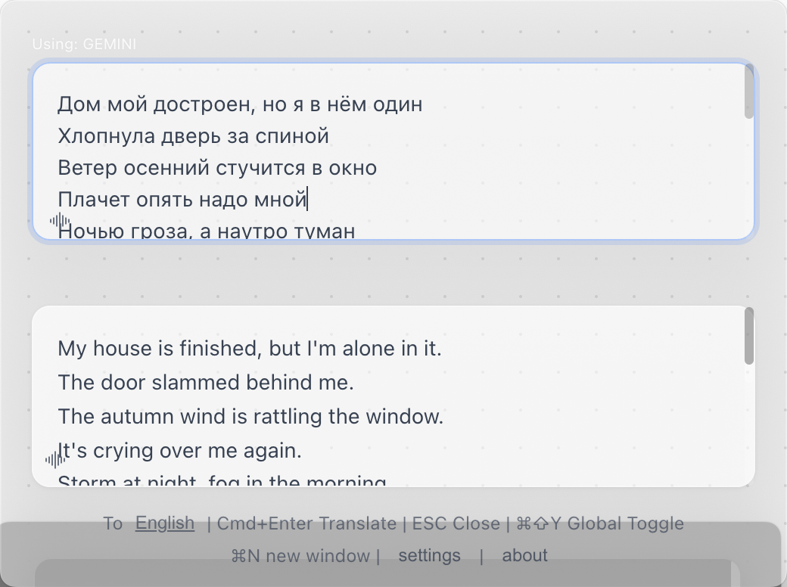
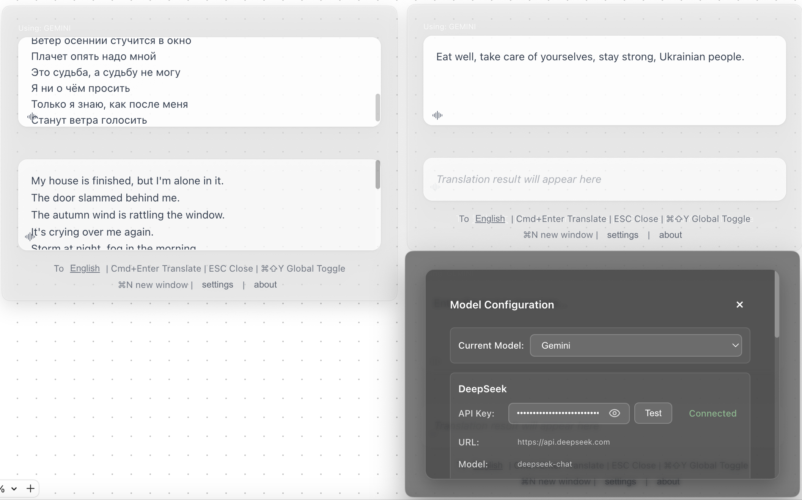
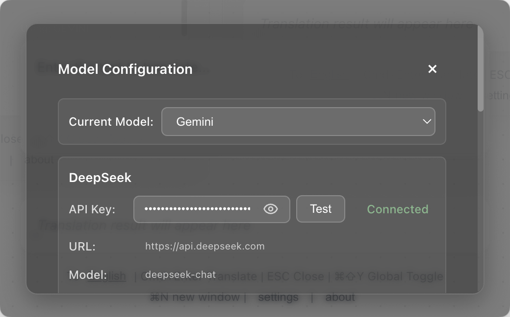

<div align="center">

# 🌍 FloatQuickTrans

**Профессиональный плавающий инструмент ИИ-перевода**

*Потоковый перевод в реальном времени • Поддержка нескольких окон • Преобразование текста в речь • Всегда поверх других окон*

[](https://github.com/hughedward/FloatQuickTrans)
[](https://github.com/hughedward/FloatQuickTrans)
[](../LICENSE)

[English](../README.md) • [简体中文](README-zh.md) • [繁體中文](README-zh-TW.md) • [日本語](README-ja.md) • [Français](README-fr.md) • [Deutsch](README-de.md) • [Español](README-es.md) • [한국어](README-ko.md) • [Русский](README-ru.md) • [Türkçe](README-tr.md)

</div>

---

## ✨ Возможности

### 🚀 **Основные функции**
- **🌊 Потоковый перевод в реальном времени** - Наблюдайте за появлением перевода в процессе генерации
- **🪟 Поддержка нескольких окон** - Создавайте несколько окон перевода с помощью `Cmd+N`/`Ctrl+N`
- **🔊 Преобразование текста в речь** - Прослушивание переводов на более чем 30 языках
- **📌 Всегда поверх других окон** - Плавающее окно остается поверх всех приложений
- **🎯 Глобальные горячие клавиши** - Быстрый доступ с помощью `Cmd+Shift+Y` или `Option+Space`

### 🤖 **Поддержка ИИ-провайдеров**
- **OpenAI GPT** - GPT-3.5, GPT-4, GPT-4o
- **DeepSeek** - Высококачественный перевод
- **Google Gemini** - Расширенные возможности ИИ
- **Claude** - Мощная языковая модель от Anthropic

---

## 🖼️ Скриншоты

<div align="center">

### Основной интерфейс


### Режим многооконности


### Панель настроек


</div>

---

## 🚀 Быстрый старт

### Требования
- Node.js 18+
- pnpm (рекомендуется) или npm

### Установка

```bash
# Клонировать репозиторий
git clone https://github.com/hughedward/FloatQuickTrans.git
cd FloatQuickTrans

# Установить зависимости
pnpm install
```

### Разработка

```bash
# Запустить сервер разработки
pnpm dev
```

---

## 🎮 Использование

### Базовый перевод
1. **Ввод текста** - Введите или вставьте текст для перевода
2. **Выбор целевого языка** - Нажмите на кнопку языка для изменения
3. **Перевод** - Нажмите `Cmd+Enter` или кнопку перевода
4. **Прослушивание** - Нажмите на значок 🔊, чтобы услышать произношение

### Работа с несколькими окнами
1. **Создание нового окна** - Нажмите `Cmd+N` (macOS) или `Ctrl+N` (Windows)
2. **Независимый перевод** - Каждое окно работает отдельно
3. **Сравнение результатов** - Используйте несколько окон для сравнения переводов

---

# 🛠️ Разработка

### Технологический стек
- **Фронтенд**: React 19 + TypeScript
- **Десктоп**: Electron 35
- **Инструменты сборки**: Vite + electron-vite
- **Стили**: CSS-эффекты стеклянного морфинга

### Структура проекта
```
src/
├── main/           # Главный процесс Electron
├── renderer/       # Фронтенд на React
├── preload/        # Предзагрузочные скрипты Electron
└── model/          # Поставщики ИИ & языковые маппинги
```

### 🫰 Участие в разработке
Мы приветствуем вклад сообщества! Если вы хотите поучаствовать, выполните следующие шаги:
1.  Форкните репозиторий
2.  Создайте ветку для новой функции (`git checkout -b feature/крутая-функция`/`git checkout -b bugfix/исправление-xxx-проблемы`)
3.  Зафиксируйте изменения (`git commit -m 'Добавлена крутая функция'`/`git commit -m 'Исправлена проблема xxx: xxxx'`). Пожалуйста, используйте описательные сообщения/сокращения при коммитах и добавляйте комментарии в код, где это возможно.
4.  Отправьте изменения в ветку (`git push origin feature/крутая-функция`/`git push origin bugfix/исправление-xxx-проблемы`). Пожалуйста, соблюдайте чистоту кода.
5.  Создайте pull request. Рекомендуем фокусироваться на одной функции или исправлении за раз, избегая массовых изменений.
6.  Мы рассмотрим ваш PR и объединим его, когда он будет готов. Если вы хотите помочь с проверкой других PR, мы будем очень благодарны!
7.  Для удобства понимания и общения рекомендуется использовать английский язык при отправке вопросов, запросов на включение изменений и других подобных действиях.

---

## 📄 Лицензия

Этот проект распространяется под лицензией MIT — подробности см. в файле [LICENSE](../LICENSE).

<div align="center">

**Сделано с ❤️ для мирового сообщества**

[⭐ Отметить проект звездой](https://github.com/hughedward/FloatQuickTrans) • [🐛 Сообщить об ошибке](https://github.com/hughedward/FloatQuickTrans/issues) • [💡 Запросить функцию](https://github.com/hughedward/FloatQuickTrans/issues)

</div>

## Star History

[](https://www.star-history.com/#hughedward/FloatQuickTrans&Date)
