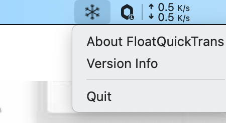
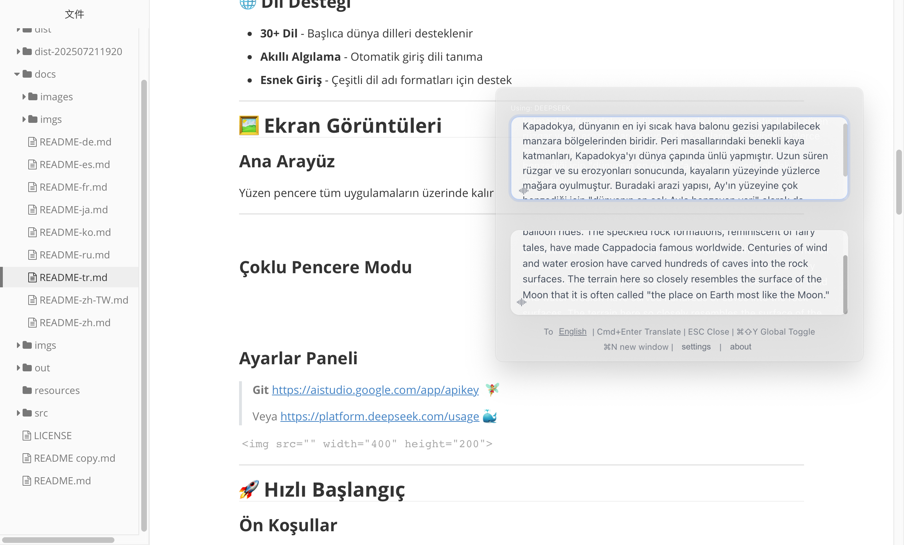
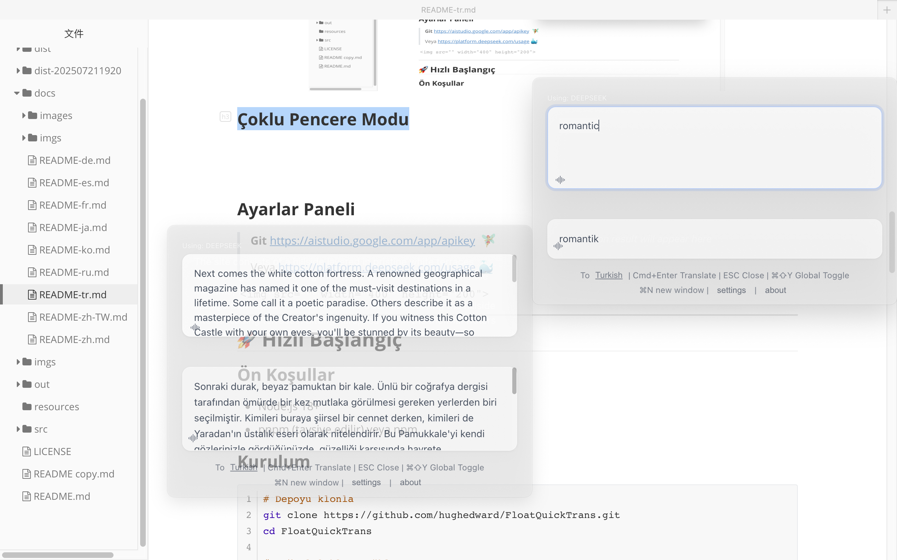
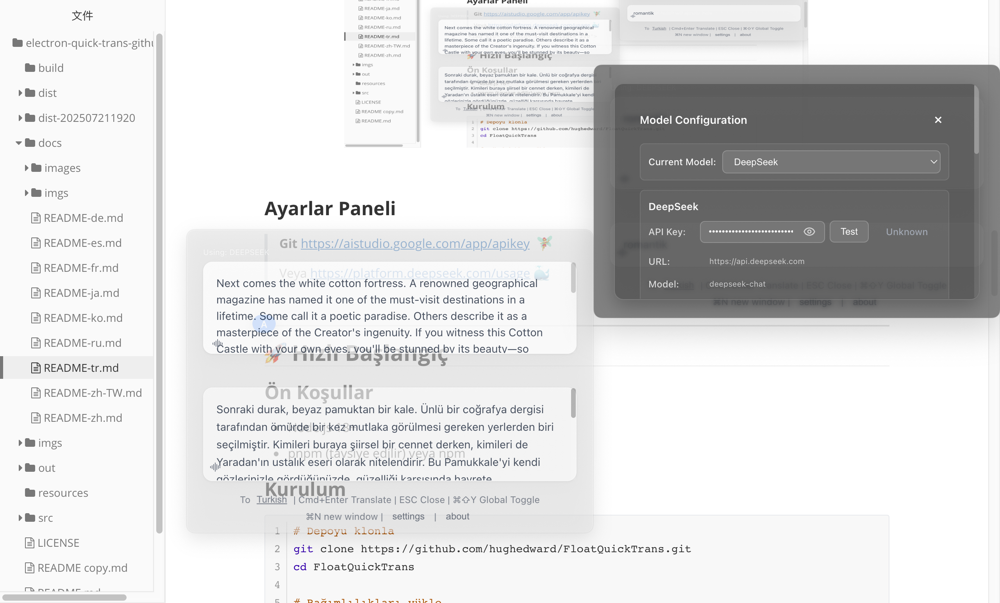

<div align="center">

# 🌍 FloatQuickTrans🎉

**Profesyonel Yüzen AI Çeviri Aracı**

*Gerçek zamanlı akış çevirisi • Çoklu pencere desteği • Metinden konuşmaya • Her zaman üstte*

[](https://github.com/hughedward/FloatQuickTrans)
[](https://github.com/hughedward/FloatQuickTrans)
[](LICENSE)

[English](README.md) • [简体中文](docs/README-zh.md) • [繁體中文](docs/README-zh-TW.md) • [日本語](docs/README-ja.md) • [Français](docs/README-fr.md) • [Deutsch](docs/README-de.md) • [Español](docs/README-es.md) • [한국어](docs/README-ko.md) • [Русский](docs/README-ru.md) • [Türkçe](docs/README-tr.md)

</div>

---

### 👀 Hızlı Bakış (Videolar)
[](https://www.youtube.com/watch?v=vU78uvya_OE)
[](https://www.youtube.com/watch?v=ki4z5593GHs)


## ✨ Özellikler

### 🚀 **Temel Yetenekler**
- **🌊 Gerçek Zamanlı Akış Çevirisi** - Çevirilerin oluştukça görünmesini izleyin
- **🪟 Çoklu Pencere Desteği** - `Cmd+N`/`Ctrl+N` ile yeni çeviri pencereleri oluşturun
- **🔊 Metinden Konuşmaya** - 30+ dilde çevirileri dinleyin
- **📌 Her Zaman Üstte** - Yüzen pencere tüm uygulamaların üzerinde kalır
- **🎯 Global Kısayollar** - `Cmd+Shift+Y` veya `Option+Space` ile hızlı erişim

### 🤖 **AI Sağlayıcı Desteği**
- <i>TODO</i>: **OpenAI GPT** - GPT-3.5, GPT-4, GPT-4o
- **DeepSeek** - Yüksek kaliteli çeviriler
- **Google Gemini** - Gelişmiş AI yetenekleri
- <i>TODO</i>:**Claude** - Anthropic'in güçlü dil modeli

> <i><font color=red>⚠️ OpenAI ve Claude: Henüz API anahtarları mevcut değil, şimdilik destek yok. Üzgünüz.</font></i>

### 🌐 **Dil Desteği**
- **30+ Dil** - Başlıca dünya dilleri desteklenir
- **Akıllı Algılama** - Otomatik giriş dili tanıma
- **Esnek Giriş** - Çeşitli dil adı formatları için destek

---

## 🖼️ Ekran Görüntüleri

### Ana Arayüz
Yüzen pencere tüm uygulamaların üzerinde kalır, Diğer programlar tam ekran modundayken bile

 

---


### Çoklu Pencere Modu




### Ayarlar Paneli

> **Git** https://aistudio.google.com/app/apikey  🧚‍♀️
>
> Veya https://platform.deepseek.com/usage 🐳



---

## 🚀 Hızlı Başlangıç

### Ön Koşullar
- Node.js 18+
- pnpm (tavsiye edilir) veya npm

### Kurulum

```bash
# Depoyu klonla
git clone https://github.com/hughedward/FloatQuickTrans.git
cd FloatQuickTrans

# Bağımlılıkları yükle
pnpm install
```

### Geliştirme

```bash
# Geliştirme sunucusunu başlat
pnpm dev
```

### Derleme

```bash
# Platformunuz için derle
pnpm build

# Platforma özel derlemeler
pnpm build:mac    # macOS
pnpm build:win    # Windows
pnpm build:linux  # Linux
```

---

## ⚙️ Yapılandırma

### API Kurulumu
1. Uygulamada **Ayarlar** düğmesine tıklayın
2. Tercih ettiğiniz AI sağlayıcısını seçin
3. API anahtarınızı girin
4. Varsayılan çeviri dilini seçin

### Desteklenen Sağlayıcılar
| Sağlayıcı | API Anahtarı Gerekli | Özellikler |
|----------|------------------|----------|
| OpenAI | TODO | GPT-3.5, GPT-4, GPT-4o |
| DeepSeek | ✅ | Yüksek kaliteli çeviri |
| Google Gemini | ✅ | Gelişmiş AI yetenekleri |
| Claude | TODO | Anthropic'in dil modeli |

---

## 🎮 Kullanım

### Temel Çeviri
1. **Metin Girin** - Çevirmek için metni yazın veya yapıştırın
2. **Hedef Dili Ayarlayın** - Dil düğmesine tıklayarak değiştirin
3. **Çevir** - `Cmd+Enter` tuşuna basın veya çevir düğmesine tıklayın
4. **Dinle** - 🔊 simgesine tıklayarak telaffuzu dinleyin

### Çoklu Pencere İş Akışı
1. **Yeni Pencere Oluştur** - `Cmd+N` (macOS) veya `Ctrl+N` (Windows) tuşlarına basın
2. **Bağımsız Çeviri** - Her pencere ayrı ayrı çalışır
3. **Sonuçları Karşılaştır** - Birden fazla pencere kullanarak çevirileri karşılaştırın

### Global Kısayollar
- `Cmd+Shift+Y` / `Ctrl+Shift+Y` - Tüm pencereleri göster/gizle
- `Cmd+N` / `Ctrl+N` - Yeni çeviri penceresi oluştur
- `Cmd+Enter` - Çeviriyi yürüt
- `ESC` - Geçerli pencereyi kapat

---

## 🛠️ Geliştirme

### Teknoloji Yığını
- **Ön Yüz**: React 19 + TypeScript
- **Masaüstü**: Electron 35
- **Derleme Aracı**: Vite + electron-vite
- **Stil**: Cam morfolojisi efektleri ile CSS

### Proje Yapısı
```
src/
├── main/           # Electron ana işlemi
├── renderer/       # React ön yüzü
├── preload/        # Electron ön yükleme betikleri
└── model/          # AI sağlayıcıları ve dil haritaları
```

### Katkı
1. Depoyu çatallayın
2. Özellik dalınızı oluşturun (`git checkout -b feature/harika-özellik`)
3. Değişikliklerinizi kaydedin (`git commit -m 'Harika özellik ekle'`)
4. Dalı itin (`git push origin feature/harika-özellik`)
5. Bir Çekme İsteği açın

---

## 📄 Lisans

Bu proje MIT Lisansı altında lisanslanmıştır - detaylar için [LICENSE](LICENSE) dosyasına bakın.

---

## 🙏 Teşekkürler

- [Electron](https://electronjs.org/) ve [React](https://reactjs.org/) ile oluşturuldu
- İkonlar [Bootstrap Icons](https://icons.getbootstrap.com/)'tan
- AI sağlayıcıları: OpenAI, DeepSeek, Google, Anthropic

---

# 🛠️ Geliştirme

### Teknoloji Yığını
- **Önyüz**: React 19 + TypeScript
- **Masaüstü**: Electron 35
- **Derleme Aracı**: Vite + electron-vite
- **Stil**: CSS cam efekti

### Proje Yapısı
```
src/
├── main/           # Electron ana işlem
├── renderer/       # React önyüz
├── preload/        # Electron önyükleme betiği
└── model/          # AI sağlayıcılar & dil eşleme
```

### 🫰 Katkıda Bulunma
Topluluk katkılarını memnuniyetle karşılıyoruz! Katkıda bulunmak isterseniz lütfen aşağıdaki adımları izleyin:
1.  Bu depoyu çatallayın (fork)
2.  Bir özellik dalı oluşturun (`git checkout -b feature/etkileyici-özellik` / `git checkout -b bugfix/xxx-sorununu-düzelt`)
3.  Değişiklikleri kaydedin (`git commit -m 'Etkileyici özellik eklendi'` / `git commit -m 'xxx sorunu düzeltildi: xxxx'`). Değişikliklerden sonra açıklayıcı mesajlar/kısaltmalar kullanarak commit yapın, kod içinde mümkün olduğunca açıklayıcı yorumlar ekleyin.
4.  Dalınıza gönderin (`git push origin feature/etkileyici-özellik` / `git push origin bugfix/xxx-sorununu-düzelt`). Lütfen kodun temiz tutulmasına özen gösterin.
5.  Bir çekme isteği (pull request) açın. Her seferinde tek bir özellik veya düzeltmeye odaklanmanızı öneririz, aynı anda çok fazla değişiklik göndermekten kaçının.
6.  PR'nizi inceleyip hazır olduğunda birleştireceğiz. Diğer PR'leri incelemeye yardımcı olmak isterseniz de minnettar kalırız!
7.  Anlayış ve iletişimi kolaylaştırmak için, soru gönderme ve çekme isteği gibi işlemlerde İngilizce kullanılması önerilir.
---

## 📄 Lisans

Bu proje MIT lisansı altında lisanslanmıştır - detaylar için [LİSANS](../LICENSE) dosyasına bakın.

<div align="center">

**Küresel topluluk için ❤️ ile yapıldı**

[⭐ Bu projeye yıldız ver](https://github.com/hughedward/FloatQuickTrans) • [🐛 Hata Bildir](https://github.com/hughedward/FloatQuickTrans/issues) • [💡 Özellik İste](https://github.com/hughedward/FloatQuickTrans/issues)

</div>

## Yıldız Geçmişi

[](https://www.star-history.com/#hughedward/FloatQuickTrans&Date)

> teşekkürler `https://www.star-history.com/#hughedward/FloatQuickTrans&Date`
Desteğiniz yaratımlarımın arkasındaki itici güçtür.🎉

