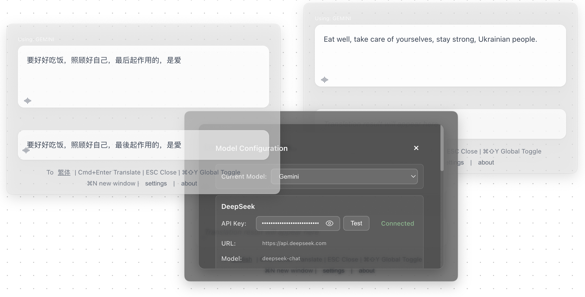

<div align="center">

# 🌍 FloatQuickTrans

**專業的懸浮AI翻譯工具**

*即時串流翻譯 • 多視窗支援 • 語音朗讀 • 始終置頂*

[](https://github.com/hughedward/FloatQuickTrans)
[](https://github.com/hughedward/FloatQuickTrans)
[](../LICENSE)

[English](../README.md) • [简体中文](README-zh.md) • [繁體中文](README-zh-TW.md) • [日本語](README-ja.md) • [Français](README-fr.md) • [Deutsch](README-de.md) • [Español](README-es.md) • [한국어](README-ko.md) • [Русский](README-ru.md) • [Türkçe](docs/README-tr.md)

</div>

---

## ✨ 功能特色

### 🚀 **核心功能**
- **🌊 即時串流翻譯** - 觀看翻譯內容即時生成
- **🪟 多視窗支援** - 使用 `Cmd+N`/`Ctrl+N` 建立多個翻譯視窗
- **🔊 語音朗讀** - 支援30+種語言的文字朗讀
- **📌 始終置頂** - 懸浮視窗始終保持在最前方
- **🎯 全局熱鍵** - 使用 `Cmd+Shift+Y` 或 `Option+Space` 快速存取

### 🤖 **AI提供商支援**
- **OpenAI GPT** - GPT-3.5, GPT-4, GPT-4o
- **DeepSeek** - 高品質翻譯
- **Google Gemini** - 先進的AI能力
- **Claude** - Anthropic的強大語言模型

---

## 🖼️ 應用截圖

<div align="center">

### 主界面


### 多視窗模式


### 設定面板


</div>

---

## 🚀 快速開始

### 環境要求
- Node.js 18+
- pnpm（推薦）或 npm

### 安裝

```bash
# 複製儲存庫
git clone https://github.com/hughedward/FloatQuickTrans.git
cd FloatQuickTrans

# 安裝依賴
pnpm install
```

### 開發

```bash
# 啟動開發伺服器
pnpm dev
```

---

## 🎮 使用方法

### 基礎翻譯
1. **輸入文字** - 輸入或貼上要翻譯的文字
2. **設定目標語言** - 點擊語言按鈕進行更改
3. **執行翻譯** - 按 `Cmd+Enter` 或點擊翻譯
4. **語音朗讀** - 點擊 🔊 圖示聽取發音

### 多視窗工作流
1. **建立新視窗** - 按 `Cmd+N` (macOS) 或 `Ctrl+N` (Windows)
2. **獨立翻譯** - 每個視窗獨立工作
3. **對比結果** - 使用多個視窗對比翻譯結果

---

<div align="center">

**用 ❤️ 為全球社群製作**

[⭐ 給專案點星](https://github.com/hughedward/FloatQuickTrans) • [🐛 回報問題](https://github.com/hughedward/FloatQuickTrans/issues) • [💡 功能建議](https://github.com/hughedward/FloatQuickTrans/issues)

</div>

## Star History
[](https://www.star-history.com/#hughedward/FloatQuickTrans&Date)
