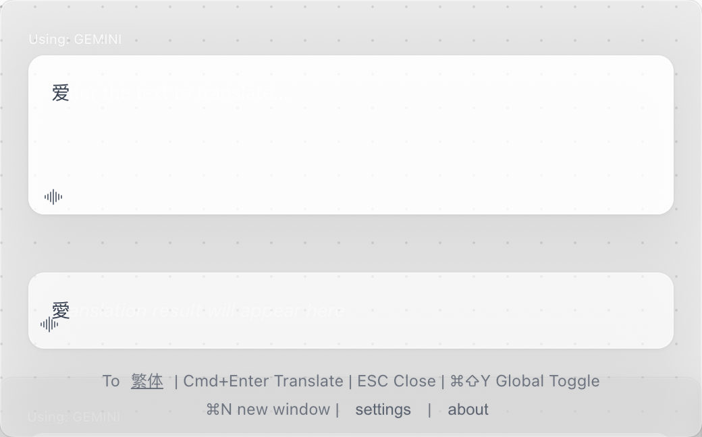
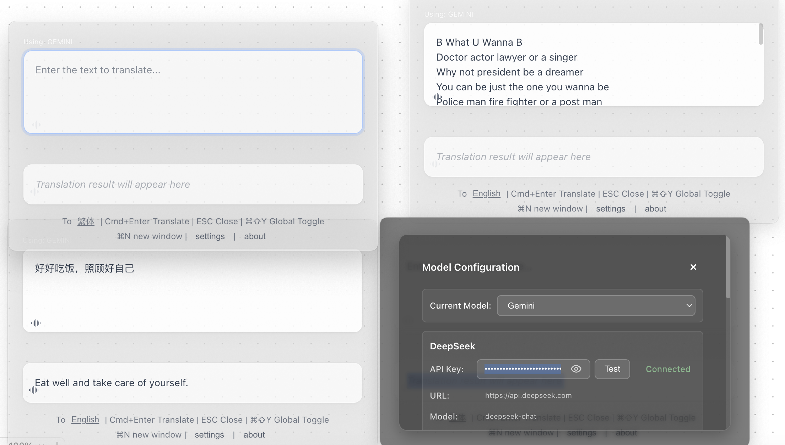

<div align="center">

# 🌍 FloatQuickTrans

**专业的悬浮AI翻译工具**

*实时流式翻译 • 多窗口支持 • 语音朗读 • 始终置顶*

**❗️严禁他人将本软件直接下载，加上 “会员/升级“按钮 后上传到 app store 等的行为，谢谢**

[](https://github.com/hughedward/FloatQuickTrans)
[](https://github.com/hughedward/FloatQuickTrans)
[](../LICENSE)

[English](../README.md) • [简体中文](README-zh.md) • [繁體中文](README-zh-TW.md) • [日本語](README-ja.md) • [Français](README-fr.md) • [Deutsch](README-de.md) • [Español](README-es.md) • [한국어](README-ko.md) • [Русский](README-ru.md) • [Türkçe](README-tr.md)

</div>

---

## ✨ 功能特色

### 🚀 **核心功能**
- **🌊 实时流式翻译** - 观看翻译内容实时生成
- **🪟 多窗口支持** - 使用 `Cmd+N`/`Ctrl+N` 创建多个翻译窗口
- **🔊 语音朗读** - 支持30+种语言的文本朗读
- **📌 始终置顶** - 悬浮窗口始终保持在最前方
- **🎯 全局热键** - 使用 `Cmd+Shift+Y` 或 `Option+Space` 快速访问

### 🤖 **AI提供商支持**
- **OpenAI GPT** - GPT-3.5, GPT-4, GPT-4o
- **DeepSeek** - 高质量翻译
- **Google Gemini** - 先进的AI能力
- **Claude** - Anthropic的强大语言模型

---

## 🖼️ 应用截图

<div align="center">

### 主界面


### 多窗口模式


### 设置面板

> search https://aistudio.google.com/app/apikey to get an api key for gemini
> Go https://aistudio.google.com/app/apikey 🧚‍♀️
> Or https://platform.deepseek.com/usage 🐳


</div>

---

## 🚀 快速开始

### 环境要求
- Node.js 18+
- pnpm（推荐）或 npm

### 安装

```bash
# 克隆仓库
git clone https://github.com/hughedward/FloatQuickTrans.git
cd FloatQuickTrans

# 安装依赖
pnpm install
```

### 开发

```bash
# 启动开发服务器
pnpm dev
```

### 构建

```bash
# 为当前平台构建
pnpm build

# 特定平台构建
pnpm build:mac    # macOS
pnpm build:win    # Windows
pnpm build:linux  # Linux
```

---

## ⚙️ 配置

### API设置
1. 点击应用中的**设置**按钮
2. 选择您偏好的AI提供商
3. 输入您的API密钥
4. 选择默认翻译语言

### 支持的提供商
| 提供商 | 需要API密钥 | 功能 |
|----------|------------------|----------|
| OpenAI | ❌ | GPT-3.5, GPT-4, GPT-4o |
| DeepSeek | ✅ | 高质量翻译 |
| Google Gemini | ✅ | 先进的AI能力 |
| Claude | ❌ | Anthropic的语言模型 |

---

## 🎮 使用方法

### 基础翻译
1. **输入文本** - 输入或粘贴要翻译的文本
2. **设置目标语言** - 点击语言按钮进行更改
3. **执行翻译** - 按 `Cmd+Enter` 或点击翻译
4. **语音朗读** - 点击 🔊 图标听取发音

### 多窗口工作流
1. **创建新窗口** - 按 `Cmd+N` (macOS) 或 `Ctrl+N` (Windows)
2. **独立翻译** - 每个窗口独立工作
3. **对比结果** - 使用多个窗口对比翻译结果

### 全局热键
- `Cmd+Shift+Y` / `Ctrl+Shift+Y` - 显示/隐藏所有窗口
- `Cmd+N` / `Ctrl+N` - 创建新翻译窗口
- `Cmd+Enter` - 执行翻译
- `ESC` - 关闭当前窗口

---

## 🛠️ 开发

### 技术栈
- **前端**: React 19 + TypeScript
- **桌面**: Electron 35
- **构建工具**: Vite + electron-vite
- **样式**: CSS 玻璃态效果

### 项目结构
```
src/
├── main/           # Electron 主进程
├── renderer/       # React 前端
├── preload/        # Electron 预加载脚本
└── model/          # AI提供商 & 语言映射
```

### 🫰参与贡献
我们欢迎社区贡献！若您想参与贡献，请按以下步骤操作：
1.  Fork本代码库
2.  创建特性分支（`git checkout -b feature/惊艳功能`/`git checkout -b bugfix/修复-xxx问题`）
3.  提交更改（`git commit -m '新增惊艳功能'`/`git commit -m '修复xxx问题:xxxx'`）。修改后请用描述性信息/简写提交，代码中请尽可能添加注释说明。
4.  推送至分支（`git push origin feature/惊艳功能`/`git push origin bugfix/修复-xxx问题`）。请保持代码整洁。
5.  发起拉取请求。建议每次专注于单个功能或修复，避免一次性提交过多改动。
6.  我们将审核您的PR并在准备就绪后合并。若您愿意协助审核其他PR，我们也将不胜感激！

---

## 📄 许可证

本项目采用 MIT 许可证 - 查看 [LICENSE](../LICENSE) 文件了解详情。

---

<div align="center">

**用 ❤️ 为全球社区制作**

[⭐ 给项目点星](https://github.com/hughedward/FloatQuickTrans) • [🐛 报告问题](https://github.com/hughedward/FloatQuickTrans/issues) • [💡 功能建议](https://github.com/hughedward/FloatQuickTrans/issues)

</div>

## Star History
[](https://www.star-history.com/#hughedward/FloatQuickTrans&Date)
